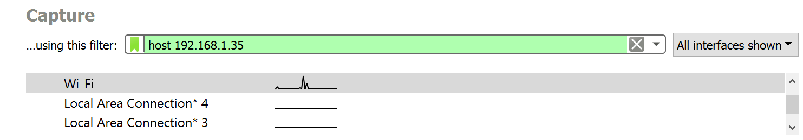
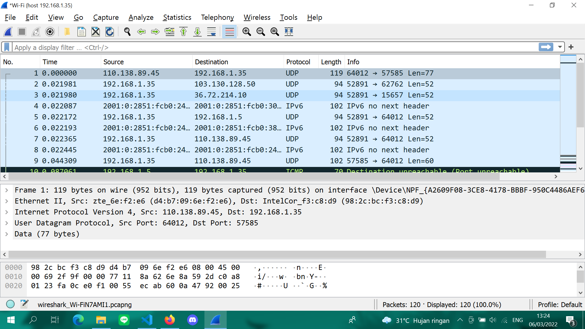
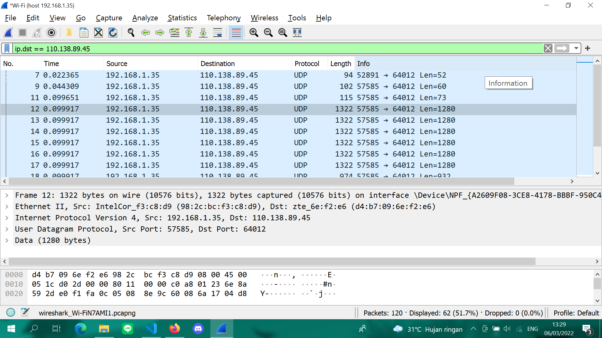

# Oprec_Admin_NCC_Third_Assignment
# Wireshark

## Link Materi Youtube
Link youtube : https://youtu.be/AtRinQS0XtM

## Definisi
<em>Wireshark </em>adalah penganalisis paket bebas dan sumber terbuka. Perangkat ini digunakan untuk pemecahan masalah jaringan, analisis, perangkat lunak dan pengembangan protokol komunikasi, dan pendidikan
<br>

## Instalasi
Sebelum memulai mengenai WIreshark, install aplikasi terlebih dahulu di https://www.wireshark.org/ untuk windows dan https://linuxtechlab.com/install-wireshark-linux-centosubuntu/ untuk linux

## Filter
Ada 2 jenis yaitu 
### capture filter
Capture Filter adalah memilah paket yang akan ditangkap (captured). Paket yang tidak memenuhi kriteria dibiarkan lewat tanpa ditangkap


Ada beberapa syntax yang biasa dipake dalam capture filter
| Perintah | Definisi |
|---|---|
| `host 192.168.1.1` | Menangkap semua paket yang spesifik menuju ke atau berasal dari alamat 192.168.1.1 |
| `src host 192.168.1.1` | Menangkap semua paket yang spesifik berasal dari alamat 192.168.1.1 |
| `net 192.168.0.0/24` atau `net 192.168.0.0 mask 255.255.255.0` | Menangkap semua paket yang berasal dari atau menuju ke subnet 192.168.0.0/24 |
| `dst net 192.168.0.0/24` | Menangkap semua paket yang menuju ke subnet 192.168.0.0/24 |
| `udp port 80` | Menangkap semua paket dengan protokol UDP yang menuju ke atau berasal dari port 80 |
| `tcp src port 22 or host 192.168.1.1` | Menangkap semua paket dengan protokol TCP yang berasal dari port 22 atau semua paket yang berasal dari atau menuju ke alamat 192.168.1.1 |

Contoh :

Pada contoh yaitu melakukan perintah `host 192.168.1.1`


### display filter
Display Filter yaitu memilah paket yang akan ditampilkan dari kumpulan paket yang sudah ditangkap

Ada beberapa contoh yang biasa dipake dalam display filter
| Perintah | Definisi |
|---|---|
| `tcp.port == 443` | Menampilkan semua paket dengan protokol TCP yang menuju ke atau berasal dari port 443 |
| `ip.src == 192.168.0.1 or ip.dst == 192.168.0.1` | Menampilkan semua paket yang berasal dari alamat 192.168.0.1 atau menuju ke alamat 192.168.0.1 |
| `http.request.uri constains "login"` | Menampilkan semua paket dengan protokol HTTP yang URI nya mengandung string "login" |

Contoh : 
Pada contoh yaitu kita melakukan perintah `ip.dst == 110.138.89.45`


data perintah yang lebih luas dapat di cari di internet. (https://www.comparitech.com/net-admin/wireshark-cheat-sheet/)

## Export Data Hasil Capture
Export data hasil capture sendiri dapat dilakukan dengan cara:

1. Cari paket yang kita tuju lebih dahulu
2. Setelah memiliki paket, pilih pada menu bar File -> Export Objects -> (protokol yang diinginkan)
3. Save dan berikan nama file, path, beserta ekstensinya jika diperlukan.

## Penggunaan Wireshark Pada FTP Server 
Jalankan aplikasi wireshark sebelum connect ke server FTP yang dituju.

###### Pembuatan Server FTP di Filezilla Server
1. Buka Filezilla Server (bisa melalui aplikasi Filezilla Server desktop atau XAMPP dengan start module Filezilla dan klik tombol Admin). Jika muncul pop up "Connect to Server" langsung saja klik Ok. Muncul tampilan berikut.

2. Klik menu Edit->Users. Di kolom Users paling kanan, tambahkan user baru dengan cara klik Add dan isikan nama user FTP nya. Berikut hasil setelah menambah user (di sini ditambah user "coba"). Jika ingin menggunakan password, centang "Password" dan masukkan password yang diinginkan.

3. Setelah user terbuat, berikutnya masuk ke setting shared folder untuk menentukan folder yang akan dishare atau diremote dengan FTP. Pada kolom Users, pilih user, dan pada kolom Shared folders, klik tombol "Add" untuk menambah direktori. Berikutnya bisa diatur akses yang akan dimiliki oleh user tersebut terhadap shared folder yang dipilih pada kotak-kotak centang pada kolom Files dan Directories.

Server untuk FTP berhasil dibuat.

#### 2.4.2 Koneksi dari Client

##### a. Menggunakan Filezilla client
Buka FileZilla dan masukkan *Host*, *Username*, *Password*, dan *Port* dari server yang akan disambungkan. Bila sudah yakin, klik *Quickconnect* untuk menyambungkan.


##### b. Menggunakan command Linux
`$ ftp [Host ip]`
Masukkan username dan password, kemudian jalankan seperti CLI


| Perintah | Keterangan |
|---|---|
| USER | Username yang digunakan untuk login ke FTP server |
| PWD | Password yang digunakan untuk login ke FTP server |)

#### 2.4.3 Upload File
##### a. Menggunakan Filezilla client
Untuk FileZilla drag file dari Local site lalu drop di Remote site

| Perintah | Keterangan |
|---|---|
| STOR | Meng-upload file ke FTP server |

##### b. Menggunakan command Linux
Command upload untuk linux
```
$ put [full path file]
```

Saat hasil capture dilihat akan muncul data dibawah ini :

#### 2.4.4 Download File
##### a. Menggunakan Filezilla client
Untuk Filezilla drag file dari Remote site ke Local site

| Perintah | Keterangan |
|---|---|
| RETR | Men-download suatu file dari FTP server |

##### b. Menggunakan command Linux
Command download untuk linux
```
$ get [nama file]
```

# Penugasan
* Penugasan bersifat individu


* Case 1

Cari filter dari soal.pcap
1. Display Filter sehingga wireshark hanya mengambil paket yang berasal dari 192.168.1.158
2. Display Filter sehingga wireshark hanya mengambil paket yang berasal dari 192.168.1.255

* Case 2

Ann adalah seorang tersangka dalam sebuah tindak kejahatan. Setelah bebas dengan uang
jaminan, Ann melarikan diri. Polisi mengatakan bahwa kemungkinan besar dia melarikan diri
bersama pacarnya. Penyidik telah memonitor lalu lintas jaringan yang digunakan Ann. Dari file
.pcap yang merupakan hasil capture lalu lintas jaringan, diharapkan investigator bisa mencari
keberadaan Ann.

Cari data sebanyak mungkin berdasar filter di dalam file soal2.zip
1. Cari data user berupa email yang ada dalam .pcap
2. Pada protokol imf terdapat 2 pesan. Cari 2 data pesan tersebut!
3. Cari data file .docx yang dikirim Ann 
4. Cari lokasi meeting Ann

* Case 3
1. Buat suatu display filter sehingga wireshark hanya mengambil paket yang mengandung port 21! (Hasil berupa display filter yang di demokan)

**Clue bisa ditanyakan di admin**

Note:

* Penemuan data atau informasi lain dapat nilai lebih
* Hasil akhir penugasan berupa repository github.
* Lakukan commit secara berkala.
* Jadikan google sebagai teman kalian.